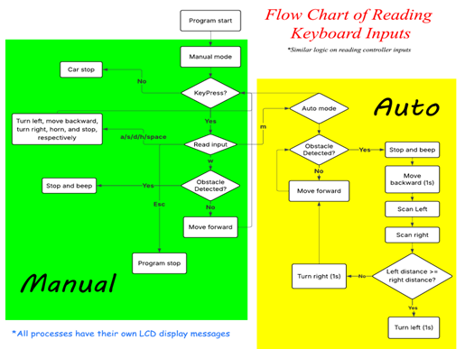

# Obstacle Avoiding RC Car
UMB ENGIN103 Final Project 

## Description
This is an RC car capable of both manual and autonomous obstacle avoidance. I developed a system featuring two operational modes. There is a manual mode where the car is controlled by the user via keyboard or controller, and it alters the user if it detects obstacles. The other mode is called auto mode where the car uses an ultra sensor to detect obstacles and automatically navigate around them. 

## Components
| Name |  Quantity  | 
|:-----|:--------:|
| Acrylic board   | 1 | 
| Arduino uno rev3   |  1  |  
| Motor driver shield L293D | 1 |  
| Battery case | 1 |
| DC power jack | 1 |
| SG90 servo motor | 1 |
| Ultra sonic sensor | 1 |
| LCD screen with I2C interface | 1 |
| Active Buzzer | 2 |
| Plastic 3d printed seats | 2 |
| Wheels and motors | 4 |
| AA 1.5v batteries | 4 |
| Jumper cables | Multi |

## Architecture Overview

## Product Picture

## Credit
Arduino Code Adapted From: <https://www.youtube.com/watch?v=A33Dxrkd-WQ>
